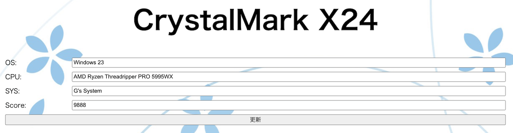

# 課題08 CRUD処理02

 

## ①課題内容（どんな作品か）
- CrystalMark X24 PHP+MariaDB版（編集機能強化版）

## ②工夫した点・こだわった点
- 登録したデータの編集・削除機能を追加しました。
- Flutterで構築したクライアントアプリからの登録を受け付けられるようにしました。（クライアントアプリは別途公開）

## ③難しかった点・次回トライしたいこと(又は機能)
- テーブル構成の見直しを行い大量のデータを管理できるようにします。
- ベンチマークスコアでソートする機能や分析する機能を作ります。

## ④質問・疑問・感想、シェアしたいこと等なんでも
参考サイト
- 講義資料
